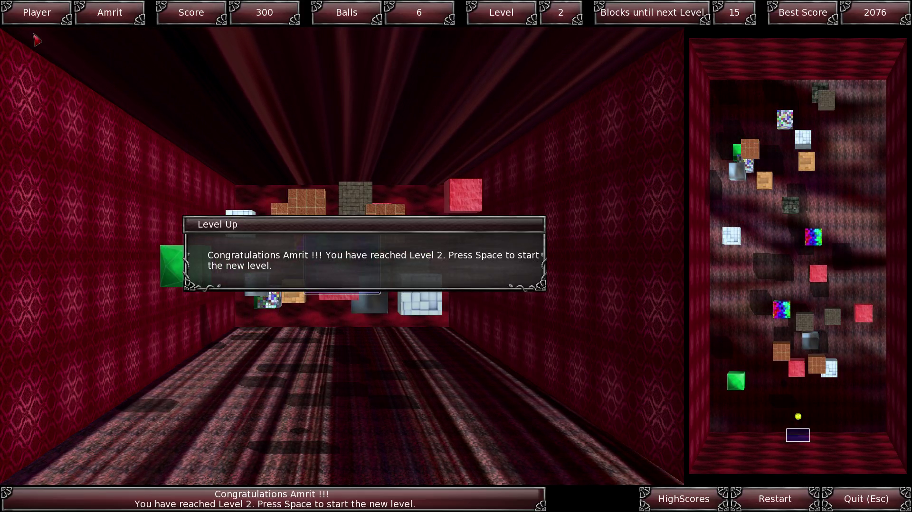
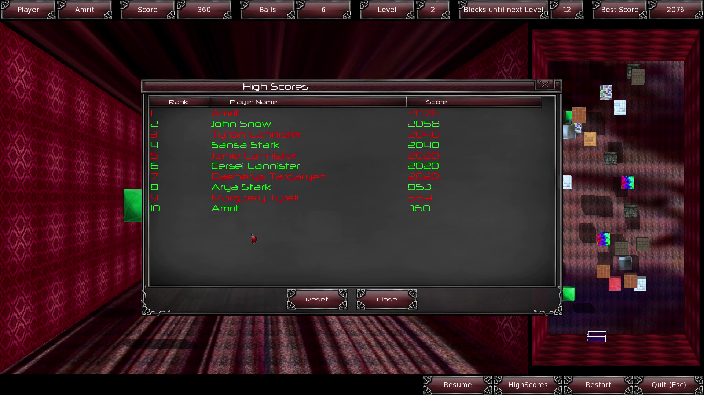
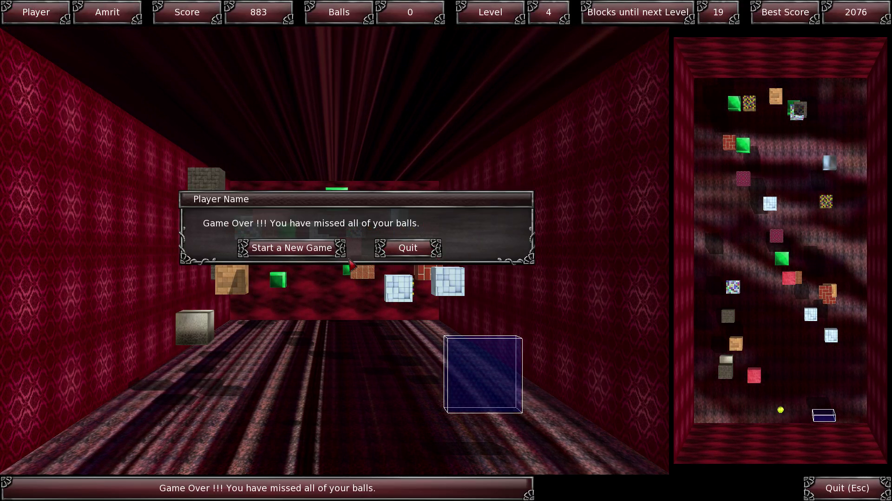

#
Breakout 3D

BreakOut 3D is a 3D version of popular BreakOut game created using Ogre Engine, CEGUI and C++. I developed this game as a part of the Mid-term project for [Game Engine Development class](http://cs.gettysburg.edu/~cpresser/cs391/breakout.html) that I took during the Spring Semester of 2015 at Gettysburg  College.  You can find more information about the game as well as instruction on how to build it here:

[BreakOut 3D | Projects | Amrit Dhakal's Website](https://www.amritdhakal.com/project/BreakOut-3D). 

Here are some screenshots from the game:

*I have used Glossy Serpent theme for CEGUI which is released under <a href="https://opensource.org/licenses/MIT" target="_blank">MIT License</a> and can be download for free from <a href="https://sourceforge.net/projects/glossyserpent/" target="_blank">here</a>.*